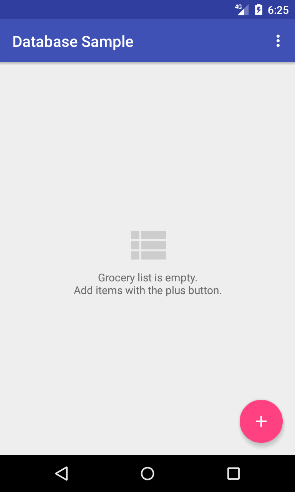
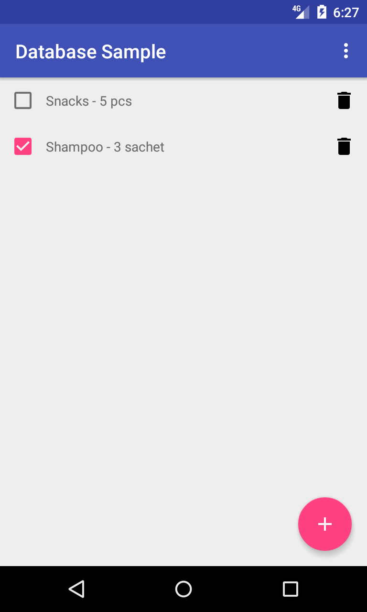
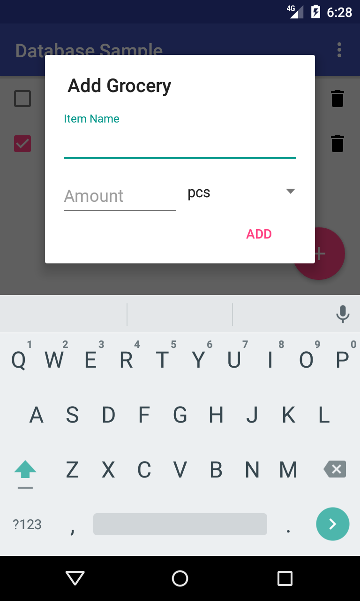

# AndroidDatabaseSample
Simple Android app to manage grocery list

  

This app is using [Cupboard](https://bitbucket.org/littlerobots/cupboard) library for data persistence. Checkout branch [cupboard](https://github.com/untungs/AndroidDatabaseSample/tree/cupboard) to find the implementation.

This app is also using [recyclerview-animators](https://github.com/wasabeef/recyclerview-animators).
